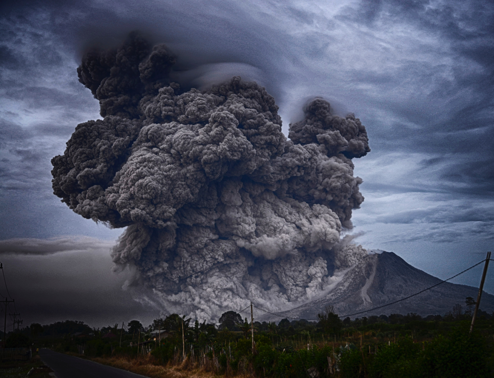

# Data Science Research project: International Disasters

    

# Introduction

EM-DAT data - https://www.emdat.be/
EM-DAT dataset contains data on the occurrence and effects of over 22,000 disasters in the world from 1900 to the present day. The dataset is weekly updated.

## Some details about the database:

For a disaster to be entered into the database at least one of the following criteria must be fulfilled:
- Ten or more people reported killed
- Hundred or more people reported affected
- Declaration of a state of emergency
- Call for international assistance

Disaster groups:
- Natural: Geophysical, Hudrological, Climatological, Meteorological, Biological
- Technological
- Complex: Famine

Disaster Measure
- Occurences:
- Total deaths
- Total affected
- Total estimated damages

Time span:
- from 1900 to 2020

# I wanted to see if both natural and technological disasters have the same death number and how is it spread around the globe.

## Research Questions
### 1. What is the main difference between technological and natural disasters?
### 2. What is spatial distribution of disasters and how it is changing in time?
### 3. How did the attitude of the outliers change over the years?

# **Content of the data analysis in Python**

1. Introduction
    - Research Questions
2. Data preparation
3. Death by disaster type
4. Log Transformation of data
5. Analysis of each disaster type: natural and technological
    - Yearly deaths
        - All events
            - Cumulative total deaths for all events
            - Spatial Distribution for all entries
        - Only events with big number of deaths
            - Cumulative Yearly Total Deaths
            - Spatial distribution -  Total Deaths by Country
            - Cumulative total deaths for each country and each year
    - Compare Natural and Technological
Spatial Distribution for all entries
Only events with big number of deaths
Cumulative Yearly Total Deaths
Spatial distribution - Total Deaths by Country
Cumulative total deaths for each country and each year
Compare Natural and Technological
